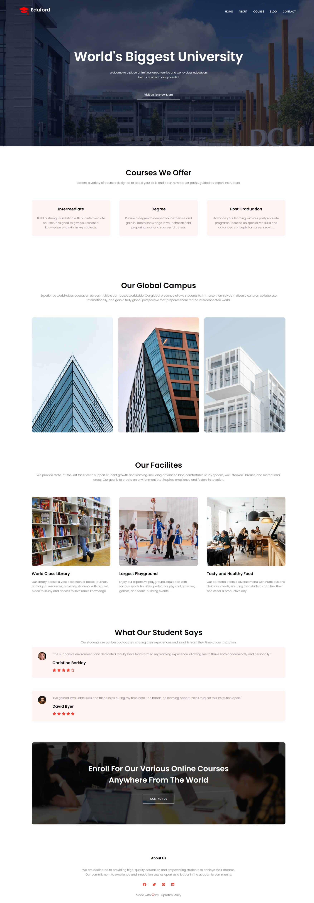
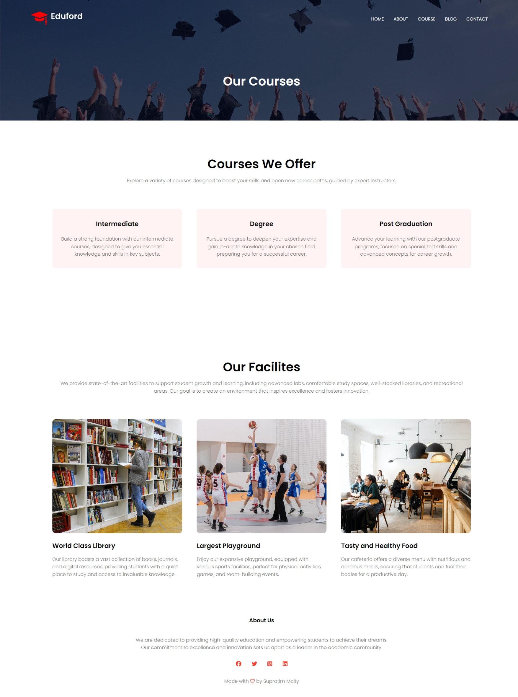
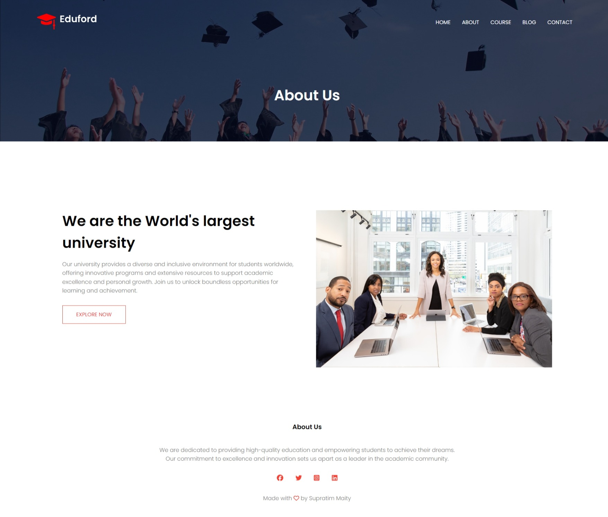
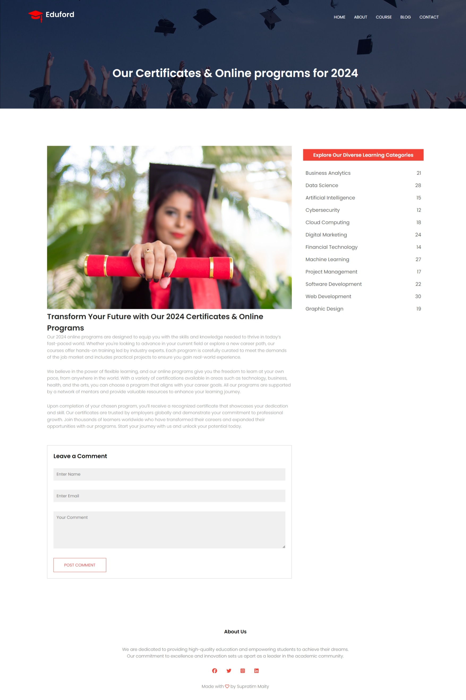
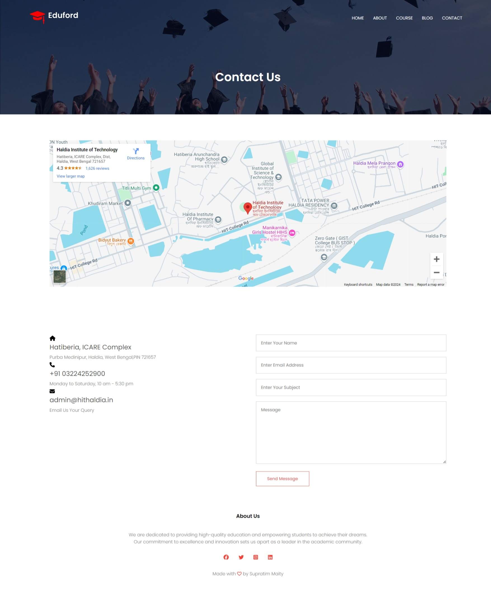

# Eduford University Website - Web Development Project

## Visit Website: [CLICK HERE](https://supratim1020.github.io/eduford_website/)

## Project Overview
The **Eduford University Website** is a fully responsive, user-friendly platform designed to showcase academic programs, courses, certificates, and events. Developed as part of my web development project, it offers easy navigation and access to important university information, built with modern web technologies for optimal usability and accessibility.

---

## Features

- **Responsive Design**: The website is designed to be fully responsive, ensuring seamless use across devices including desktop, tablets, and mobile phones.
- **Course and Program Showcase**: Displays detailed information about the university’s various academic programs, online certificates, and courses available for 2024.
- **Interactive Sections**: Easy-to-navigate sections for exploring courses by category, university news, events, and more.
- **Modern UI/UX Design**: Clean and visually appealing design to enhance user experience.
- **Multi-Page Structure**: Includes pages for course details, about the university, certificate programs, events, and contact information.
  
---
## Technologies Used

- **HTML5**: Structuring the web pages and content.
- **CSS3**: Styling the website with modern layout techniques like Flexbox and Grid for responsiveness.
- **JavaScript**: Adding interactive elements like hover effects, form validations, and dynamic content updates.
- **Responsive Web Design**: Ensuring the website is fully responsive and optimized for all screen sizes.

---

## Project Structure

- **index.html**: Homepage displaying the university banner, program categories, and featured courses.
- **courses.html**: Page showcasing detailed information on various academic programs and their descriptions.
- **about.html**: Information about the university, including history, mission, and values.
- **contact.html**: A contact page with a form for prospective students or faculty to reach out.
- **styles.css**: Custom CSS to style the website elements and ensure responsive layouts.
- **images/**: Folder containing all images used on the site, including banners, icons, and course-related visuals.

---

## Screenshots

### Homepage
The homepage offers an overview of the university's key offerings, including courses, certificates, and featured programs.



### Course and Program Listings
Shows the diverse range of academic programs and certification options available for the upcoming year.



### University About Page
Provides an overview of the university’s history, vision, and achievements.



### Blog Page
Shows the diverse range of academic programs and certification options available for the upcoming year.
A section for prospective students or faculty to get in touch with the university.



### Contact Form
A section for prospective students or faculty to get in touch with the university.



---


## How to Run the Project

- Clone the repository to your local machine:
   ```bash
   git clone https://github.com/supratim1020/eduford_website.git
